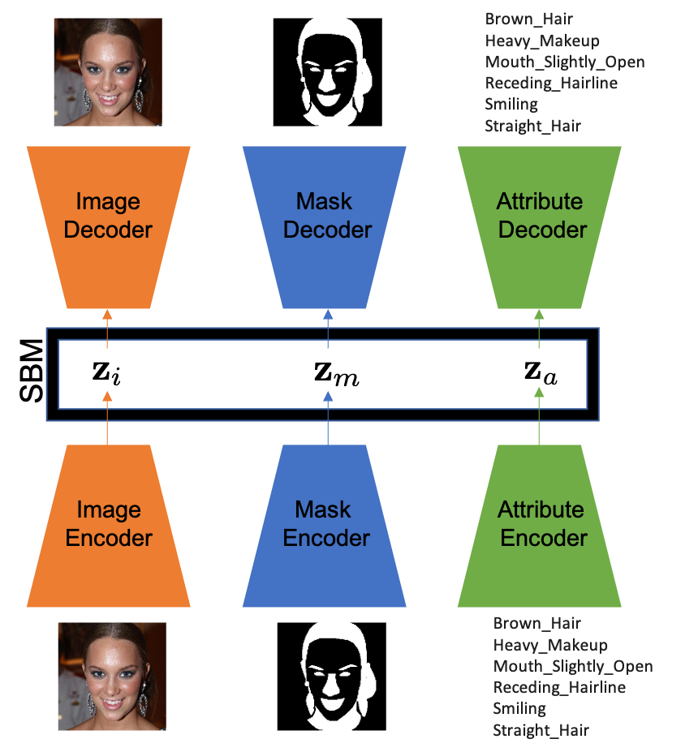

# Score Based Multimodal Autoencoders
> This is the code for the paper [Score Based Multimodal Autoencoders](https://openreview.net/forum?id=JbuP6UV3Fk)

<!--  -->


## Get started (Extended PolyMnist)
* Download the dataset and the FID model*
!-- *Download the preprocessed dataset from [here](https://uofi.box.com/s/jmhbpiw304gbtx4ulxd0m1cejctp8437)*
*Download the FID model from [here](https://uofi.box.com/s/twh6zi2sp8hxsrthnxkv4oqbd8xs01gm)* -->
```bash
    pip install -r requirements.txt
    mv pt_inception-2015-12-05-6726825d.pth ./pytorch_fid/
    tar xvzf upd_poly.tar
    ./train_poly.sh
```

## Get started (CelebMaskHQ)
* Download the dataset and the FID model*
*Download the preprocessed dataset from [here](https://uofi.box.com/s/d4rnm3gr3a2opgw2o97i6x5zuosq8ve3)*
*Download the FID model from [here](https://uofi.box.com/s/twh6zi2sp8hxsrthnxkv4oqbd8xs01gm)*

```bash
    pip install -r requirements.txt
    mv pt_inception-2015-12-05-6726825d.pth ./pytorch_fid/
    tar xvzf celm_hq.tar
    ./train_cel.sh
```

### To train the EBM model, please look at train_cel_clwithtime_ebm_NOIND.py script
### For sampling and other calclations, please look at the scripts.
